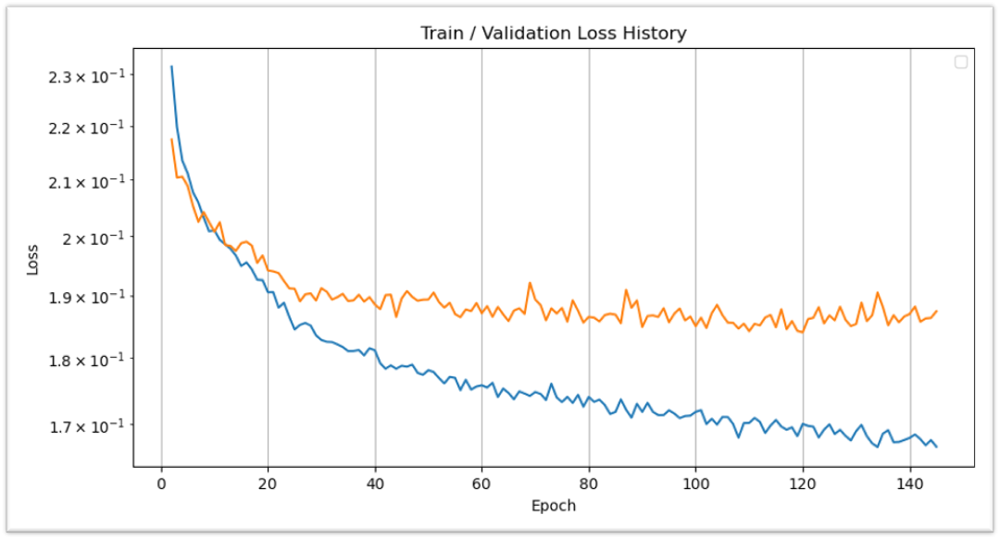
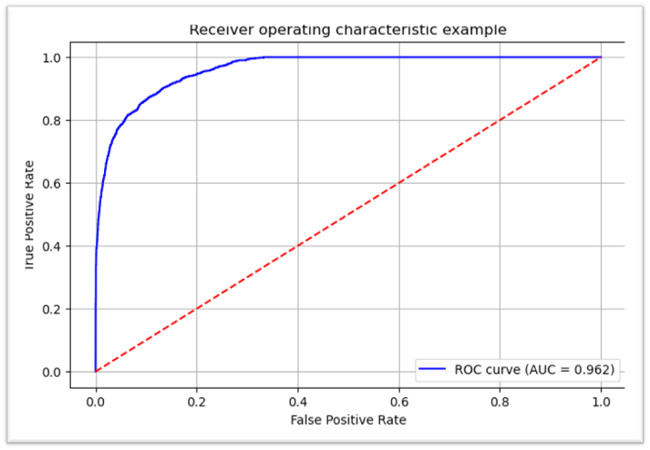

# 은행 대출 승인 예측 시스템

## 1. 문제 정의

- **목표**: 고객 정보를 바탕으로 대출 승인 여부를 예측하는 이진 분류 문제
- **입력 데이터**: 고객의 개인정보, 대출정보, 신용정보 (총 13개 특성)
- **출력 데이터**: 대출 승인(1) 또는 거절(0)

## 2. 데이터 설명

- **데이터 출처**: 은행 대출 신청 기록
- **데이터 구성**:
  - 총 45,000개의 대출 신청 기록
  - 13개의 입력 특성:
    - 개인정보: 나이, 성별, 최고교육수준, 연간소득, 직장경력, 주택소유상태
    - 대출정보: 대출금액, 대출목적, 금리, 소득대비대출비율
    - 신용정보: 신용기록기간, 신용점수, 이전연체여부
  - 출력 데이터: 대출 승인(1) 또는 거절(0)
    
- **범주형 데이터**:
  - 성별, 최고교육수준, 주택소유상태, 대출목적, 이전대출연체여부
- **데이터 분할**:
  - 학습 데이터: 60% (27,000개)
  - 검증 데이터: 20% (9,000개)
  - 테스트 데이터: 20% (9,000개)
- **데이터 전처리**:

  - 범주형 데이터의 레이블 인코딩

    ```python
    from sklearn.preprocessing import LabelEncoder

    # 범주형 데이터 컬럼
    categorical_columns = ["성별", "최고교육수준", "주택소유상태", "대출목적", "이전연체여부"]

    # 각 컬럼의 유니크 값 확인
    display(df[categorical_columns].head())

    # 범주형 데이터 레이블 인코딩
    label_encoder = LabelEncoder()
    for col in categorical_columns:
        df[col] = label_encoder.fit_transform(df[col])

    display(df[categorical_columns].head())
    ```

  - 수치형 데이터의 표준화

    ```python
    # 표준화 스케일링
    standard_scaler = StandardScaler()
    x_train_scaled = torch.from_numpy(standard_scaler.fit_transform(x[0].numpy())).float()
    x_val_scaled = torch.from_numpy(standard_scaler.transform(x[1].numpy())).float()
    x_test_scaled = torch.from_numpy(standard_scaler.transform(x[2].numpy())).float()

    x = [x_train_scaled, x_val_scaled, x_test_scaled]
    y = [y[0].float(), y[1].float(), y[2].float()]

    df = pd.DataFrame(x[0], columns=df.columns[0:-1])
    df.head()
    ```

- **데이터 셔플**:
  ```python
  indices = torch.randperm(row_count)
  x = torch.index_select(x, dim=0, index=indices)
  y = torch.index_select(y, dim=0, index=indices)
  x = x.split(counts, dim=0)
  y = y.split(counts, dim=0)
  ```

## 3. 모델 구조

- **모델**: 다층 퍼셉트론(MLP)
- **손실함수**: Binary Cross Entropy
- **활성화 함수**: LeakyReLU, Sigmoid
- **최적화 알고리즘**: Adam

```**python**
for i in range(n_epochs):
    # 데이터 셔플
    indices = torch.randperm(x[0].size(0))
    x_ = torch.index_select(x[0], dim=0, index=indices)
    y_ = torch.index_select(y[0], dim=0, index=indices)

    # 배치 분할
    x_ = x_.split(batch_size, dim=0)
    y_ = y_.split(batch_size, dim=0)
    train_loss, valid_loss = 0, 0
    y_hat = []

    # 배치 학습
    for x_i, y_i in zip(x_, y_):
        y_hat_i = model(x_i)
        loss = F.binary_cross_entropy(y_hat_i, y_i)
        optimizer.zero_grad()
        loss.backward()
       
        optimizer.step()
        train_loss += float(loss)
```

## 4. 실험 결과 및 하이퍼파라미터

### 4.1. (실험1) 2층 구조

| 항목          | 값         |
| ------------- | ---------- |
| Optimizer     | Adam       |
| Learning Rate | 0.001      |
| Batch Size    | 128        |
| Early Stop    | 25 Epoch   |
| Test Loss     | 1.9639e-01 |
| Test Accuracy | 0.9107     |
| F1 Score      | 0.7869     |
| AUROC Score   | 0.9620     |

```python
model = nn.Sequential(
    nn.Linear(input_size, 16),
    nn.LeakyReLU(),

    nn.Linear(16, output_size),
    nn.Sigmoid()
)
```


```console
에포크 330/1000: 학습 손실: 1.8567e-01, 검증 손실: 1.9231e-01, 최저 손실: 1.9214e-01
마지막 25 에포크 동안 개선이 없습니다.
에포크 309에서 최적의 검증 손실: 1.9214e-01
```

<hr />

### 4.2. (실험2) 3층 구조 + Dropout

| 항목          | 값         |
| ------------- | ---------- |
| Optimizer     | Adam       |
| Learning Rate | 0.001      |
| Batch Size    | 128        |
| Early Stop    | 25 Epoch   |
| Test Loss     | 1.9486e-01 |
| Test Accuracy | 0.9130     |
| F1 Score      | 0.7907     |
| AUROC Score   | 0.9617     |

```python
model = nn.Sequential(
    nn.Linear(input_size, 32),
    nn.LeakyReLU(),
    nn.Dropout(0.2),

    nn.Linear(32, 16),
    nn.LeakyReLU(),
    nn.Dropout(0.2),

    nn.Linear(16, output_size),
    nn.Sigmoid()
)
```


```console
에포크 110/1000: 학습 손실: 1.9415e-01, 검증 손실: 1.9620e-01, 최저 손실: 1.9309e-01
마지막 25 에포크 동안 개선이 없습니다.
에포크 94에서 최적의 검증 손실: 1.9309e-01
```

<hr />

### 4.3. (실험3) 3층 구조 + Batch Normalization

| 항목          | 값         |
| ------------- | ---------- |
| Optimizer     | Adam       |
| Learning Rate | 0.001      |
| Batch Size    | 128        |
| Early Stop    | 25 Epoch   |
| Test Loss     | 1.9486e-01 |
| Test Accuracy | 0.9130     |
| F1 Score      | 0.7907     |
| AUROC Score   | 0.9617     |

```python
model = nn.Sequential(
    nn.Linear(input_size, 32),
    nn.LeakyReLU(),
    nn.BatchNorm1d(32),

    nn.Linear(32, 16),
    nn.LeakyReLU(),
    nn.BatchNorm1d(16),

    nn.Linear(16, output_size),
    nn.Sigmoid()
)
```



```console
에포크 140/1000: 학습 손실: 1.6769e-01, 검증 손실: 1.8659e-01, 최저 손실: 1.8404e-01
마지막 25 에포크 동안 개선이 없습니다.
에포크 121에서 최적의 검증 손실: 1.8404e-01
```

<hr />

### 4.4. (실험4) 3층 구조 + Dropout + Batch Normalization

| 항목          | 값         |
| ------------- | ---------- |
| Optimizer     | Adam       |
| Learning Rate | 0.001      |
| Batch Size    | 128        |
| Early Stop    | 25 Epoch   |
| Test Loss     | 1.9418e-01 |
| Test Accuracy | 0.9148     |
| F1 Score      | 0.7952     |
| AUROC Score   | 0.9641     |

```python
model = nn.Sequential(
    nn.Linear(input_size, 32),
    nn.LeakyReLU(),
    nn.BatchNorm1d(32),
    nn.Dropout(0.2),

    nn.Linear(32, 16),
    nn.LeakyReLU(),
    nn.BatchNorm1d(16),
    nn.Dropout(0.2),

    nn.Linear(16, output_size),
    nn.Sigmoid()
)
```


```console
에포크 170/1000: 학습 손실: 1.9143e-01, 검증 손실: 2.1045e-01, 최저 손실: 2.0818e-01
마지막 25 에포크 동안 개선이 없습니다.
에포크 149에서 최적의 검증 손실: 2.0818e-01
```

<hr />

### 4.5. (실험5) 4층 구조 + Dropout + Batch Normalization

| 항목          | 값         |
| ------------- | ---------- |
| Optimizer     | Adam       |
| Learning Rate | 0.001      |
| Batch Size    | 128        |
| Early Stop    | 25 Epoch   |
| Test Loss     | 2.0383e-01 |
| Test Accuracy | 0.9064     |
| F1 Score      | 0.7810     |
| AUROC Score   | 0.9611     |

```python
model = nn.Sequential(
    nn.Linear(input_size, 64),
    nn.LeakyReLU(),
    nn.BatchNorm1d(64),
    nn.Dropout(0.2),

    nn.Linear(64, 32),
    nn.LeakyReLU(),
    nn.BatchNorm1d(32),
    nn.Dropout(0.2),

    nn.Linear(32, 16),
    nn.LeakyReLU(),
    nn.BatchNorm1d(16),
    nn.Dropout(0.2),

    nn.Linear(16, output_size),
    nn.Sigmoid()
)
```


```console
에포크 110/1000: 학습 손실: 1.8615e-01, 검증 손실: 2.0161e-01, 최저 손실: 1.9857e-01
마지막 25 에포크 동안 개선이 없습니다.
에포크 90에서 최적의 검증 손실: 1.9857e-01
```

<hr />

## 5. 모델 성능

- **ROC-AUC 점수**: 0.9619

  
- **혼동 행렬 분석** 결과 시각화

  
- **예측 확률 분포** 시각화


  
- **F1 Score**: 0.7974
  ||정밀도|재현율|f1-score|샘플 수|
  |-|-|-|-|-|
  |대출 승인|0.86|0.74|0.80|2055|
  |대출 거절|0.93|0.96|0.95|6945|
  |정확도|||0.91|9000|
  |marco avg|0.89|0.85|0.87|9000|
  |weighted avg|0.91|0.91|0.91|9000|

<hr />

## 6. 결론

- 3층 구조의 MLP 모델에 Batch Normalization을 추가한 모델이 가장 좋은 성능을 보임
- ROC-AUC 점수 0.9619로 높은 예측 정확도 달성
- F1 Score 0.7974로 높은 예측 정확도 달성

## 7. GitHub 주소

- 프로젝트 데이터셋: [Link](https://www.kaggle.com/datasets/taweilo/loan-approval-classification-data/data)
